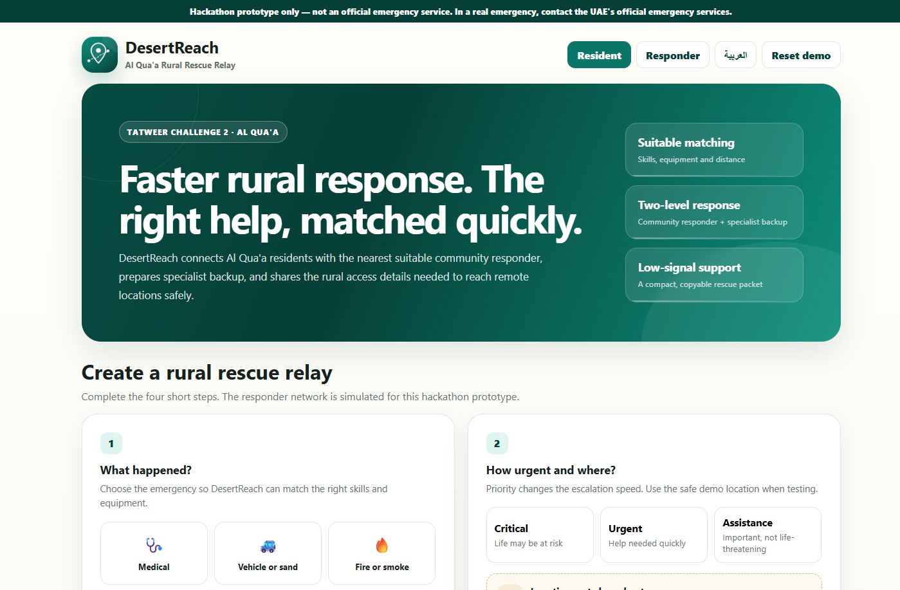
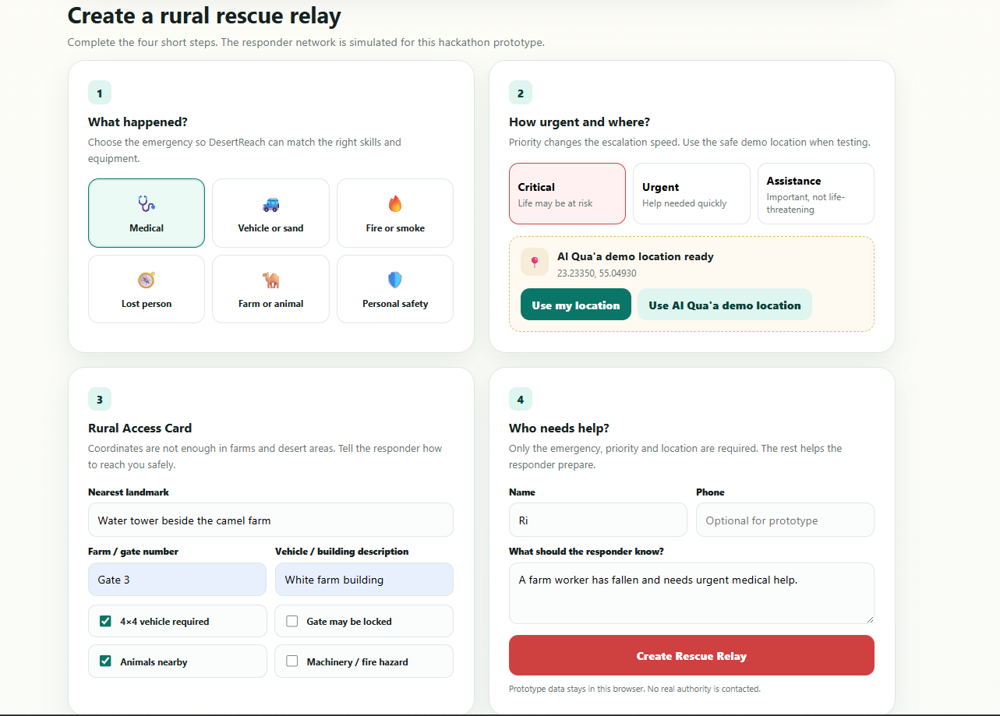
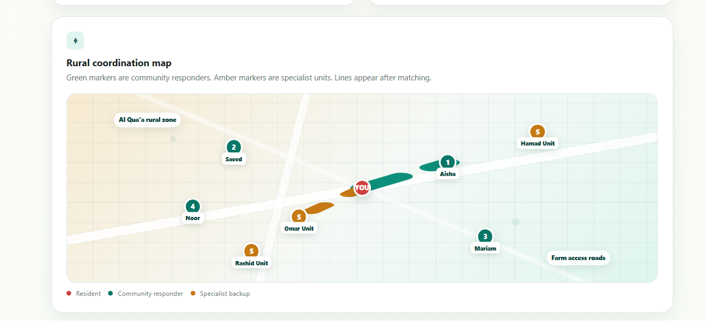
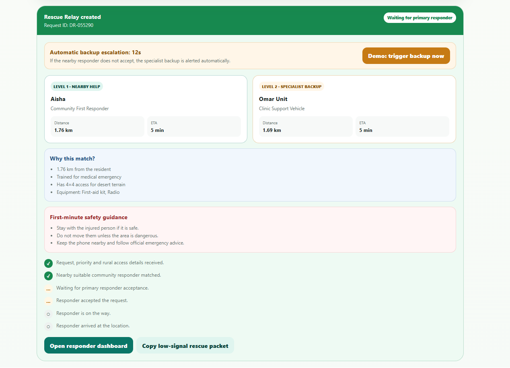
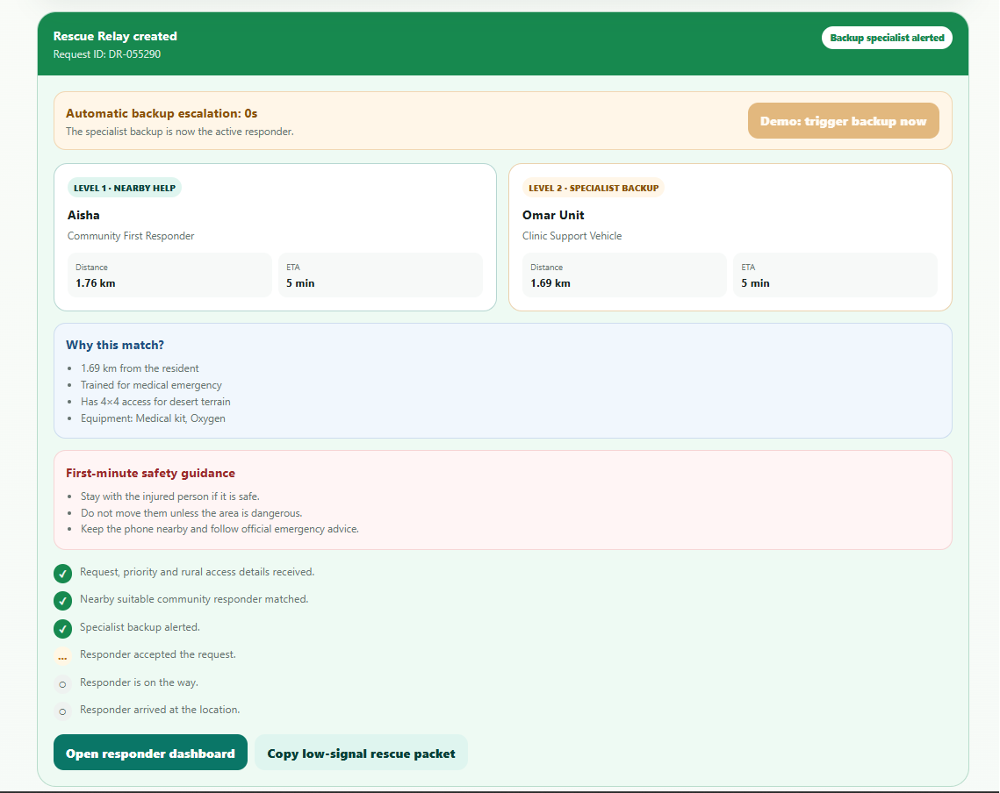
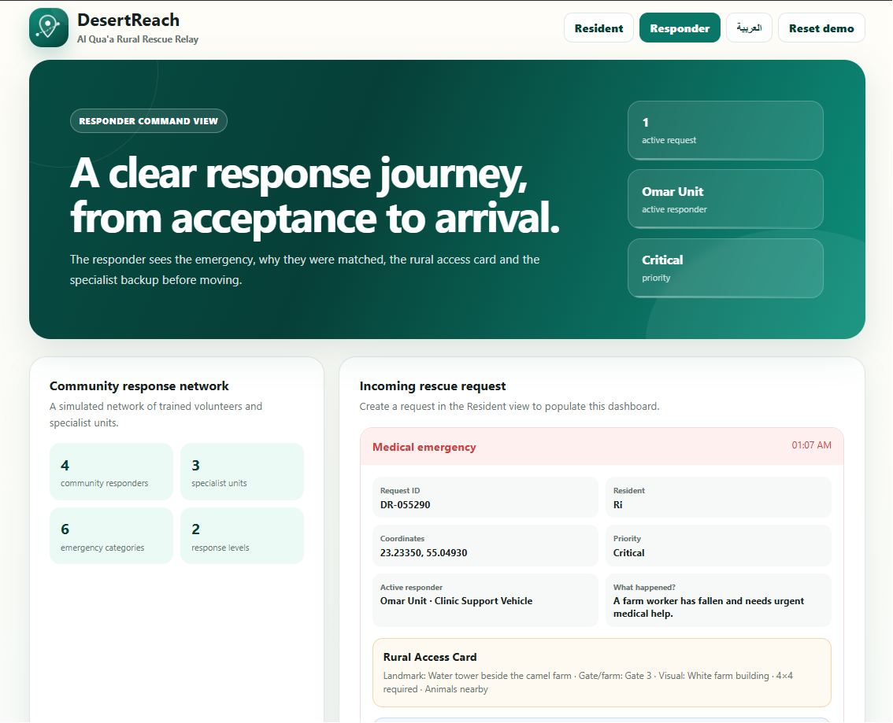
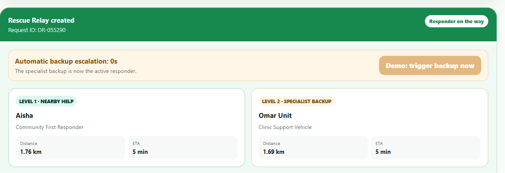
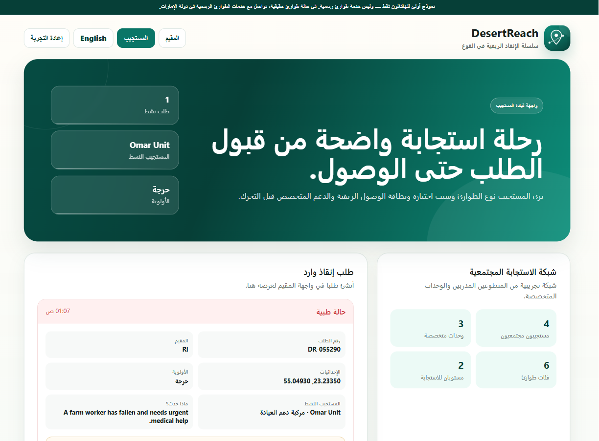

# DesertReach

### Al Qua’a Rural Rescue Relay

**Faster rural response. The right help, matched quickly.**

[Live Prototype](https://riyaazx.github.io/DesertReach/) · [GitHub Repository](https://github.com/Riyaazx/DesertReach)

---

## Demo Video

**3-minute walkthrough:** problem, purpose, resident request, responder matching, backup escalation, responder dashboard, Arabic support and low-signal rescue packet.

[Watch the DesertReach Demo Video](https://drive.google.com/file/d/18JY6P9tRUqwiVZZB8vhQ9SBPU6HYbvaf/view?usp=sharing)

---

> **Safety notice:** DesertReach is a hackathon prototype, not an official emergency service. All responders, ETAs and integrations shown in the prototype are simulated. In a real emergency, users must contact the UAE’s official emergency services.

## Challenge

DesertReach was created for **Tatweer Hackathon 2026 — Challenge 2**, focused on helping people receive urgent support across the dispersed community of Al Qua’a.

Al Qua’a includes farms, desert roads and widely separated homes. In an urgent situation, sharing coordinates alone may not be enough. Responders may also need the correct farm gate, a visible landmark, terrain information, a suitable vehicle and awareness of nearby hazards.

## Why DesertReach matters

In rural areas, emergency response is not only about sending a location. The responder also needs to understand how to reach the person safely.

DesertReach was designed to quickly answer three important questions:

1. Where is the person?
2. Who nearby is suitable to help?
3. What details does the responder need to reach them safely?

The goal is to make the first few minutes of rural emergency coordination faster, clearer and more organised.

## What DesertReach does

DesertReach creates a **two-level Rescue Relay**:

1. A resident selects the emergency, urgency and location.
2. The resident adds rural access details.
3. The system matches the nearest suitable community responder.
4. A specialist backup is prepared at the same time.
5. If the first responder does not accept before the countdown ends, the backup becomes active.
6. The responder can update the request from accepted to on the way and arrived.
7. A compact rescue packet can be copied for use in SMS or WhatsApp when connectivity is weak.

The prototype does not simply choose the nearest person. It considers emergency suitability, equipment, 4×4 access and distance.

## Resident request

Residents can choose from six emergency categories:

* Medical
* Vehicle or sand
* Fire or smoke
* Lost person
* Farm or animal
* Personal safety

They can also add:

* nearest landmark;
* farm or gate number;
* vehicle or building description;
* 4×4 requirement;
* locked-gate warning;
* nearby animals;
* machinery or fire hazards.

## Rural coordination map

The schematic map shows:

* the resident location;
* four simulated community responders;
* three simulated specialist units;
* primary and backup routes.

## Explainable matching

For each request, DesertReach displays:

* the nearby community responder;
* the specialist backup;
* distance and ETA;
* why the responder was selected;
* available equipment;
* first-minute safety guidance;
* request progress.

## Automatic backup escalation

The escalation timer depends on urgency:

| Priority   | Prototype timer |
| ---------- | --------------: |
| Critical   |      25 seconds |
| Urgent     |      40 seconds |
| Assistance |      60 seconds |

When the timer reaches zero, the specialist backup becomes the active responder.

## Responder dashboard

The responder can see:

* emergency type and priority;
* resident coordinates and notes;
* the Rural Access Card;
* the reason they were matched;
* action buttons for accepting, travelling, arriving or escalating.

## Arabic interface

The prototype supports English and Arabic, including right-to-left layout.

## Main features

| Feature                     | Description                                                 |
| --------------------------- | ----------------------------------------------------------- |
| Suitable responder matching | Uses emergency type, distance, equipment and terrain access |
| Two-level response          | Community responder plus specialist backup                  |
| Rural Access Card           | Adds landmarks, gates and hazard information                |
| Automatic escalation        | Activates backup if the first responder does not accept     |
| Status tracking             | Accepted, on the way and arrived                            |
| Low-signal packet           | Creates a compact copyable message                          |
| Bilingual interface         | English and Arabic                                          |
| Local persistence           | Saves the current request in the browser                    |
| Responsive design           | Works across different screen sizes                         |

## How the matching works

The matching logic is rule-based and explainable.

1. A responder must support the selected emergency.
2. Shorter distance improves the score.
3. Community responders are preferred for the first response level.
4. Specialist units are preferred for backup.
5. A 4×4 requirement strongly favours responders with suitable access.
6. Critical requests slightly increase specialist priority.

Distance is calculated using the Haversine formula. ETA values are illustrative prototype estimates.

## Technology

* HTML5
* CSS3
* Vanilla JavaScript
* Browser Geolocation API
* Local Storage API
* Clipboard API
* Git and GitHub
* GitHub Pages

## Run locally

1. Download or clone the repository.
2. Open `index.html` in a modern browser.
3. Use **Al Qua’a demo location** for a safe demonstration.
4. No installation or API key is required.

## Limitations

* Responders, locations, availability and ETAs are simulated.
* No real emergency authority, clinic or volunteer is contacted.
* The map is schematic and not live navigation.
* The low-signal feature creates a copyable message but does not send SMS automatically.
* There is no production authentication, secure backend or responder verification.
* ETA values do not use live traffic or road conditions.

## Future development

A real pilot would require:

* verified responder onboarding;
* secure accounts and a backend database;
* live availability and notifications;
* SMS fallback;
* privacy controls and audit logs;
* approved local partnerships and operating procedures;
* real-world usability and response-time testing.

Al Qua’a is the first use case. The same model could later be adapted for other rural communities.

## Responsible AI use

AI-assisted tools were used for ideation, code drafting, interface refinement and documentation support. The participant selected the challenge, shaped the concept, integrated the prototype and reviewed the final submission.

The responder matching logic is not machine learning. It is a transparent rule-based prototype.

## Built by

**Riya Aktar**

BSc Computer Science with Artificial Intelligence, Coventry University

## License

MIT License

---

**Built for Tatweer Hackathon 2026 — Challenge 2**
